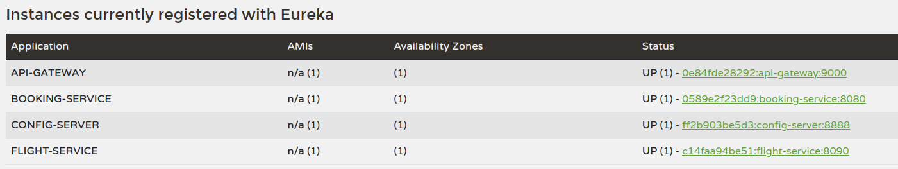
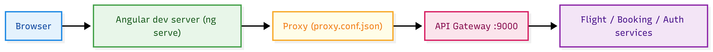
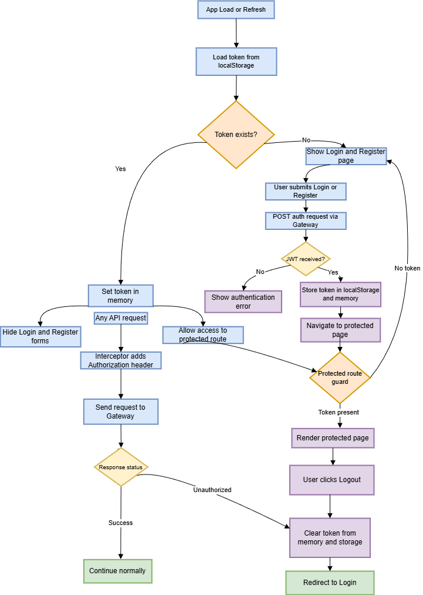
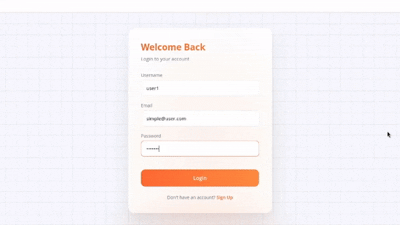
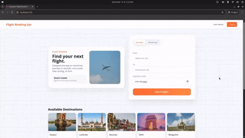
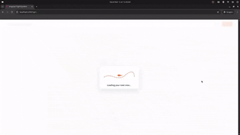
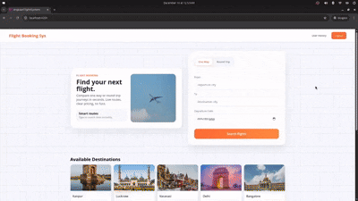

# FlightBookingSystem w/ Angular

The Angular front end relies on a Dockerized microservice backend (API gateway exposed on port 9000) that is brought up via a single Docker Compose stack. Backend repository: https://github.com/kanchanraiii/FlightBookingSysWSecurity.

  
   
  <small>Figure 1. Eureka dashboard with registered instances</small>

Backend Overview: JWT-secured Spring Boot microservices behind an API Gateway (mapped to 9000 here) with Eureka discovery, Config Server, and flight/booking services on MongoDB. Core routes cover auth (`/auth/*`), public flight search/listing, and protected booking operations exposed through the gateway.

Frontend API calls traverse the gateway on port 9000 to the flight and booking services once the Docker stack is running.

## Project Report 

[Report](https://github.com/kanchanraiii/AngularFlightSystem/raw/main/Week%208%20-%20Angular%20Flight%20Booking%20Sys.pdf)

## Proxy Setup (Angular dev)
- The dev server uses `proxy.conf.json` to forward `/auth`, `/flight`, and `/booking` calls to `http://localhost:9000`.
- With `ng serve --proxy-config proxy.conf.json`, the app can call relative paths (e.g., `/auth/login`) without CORS errors.
- In production builds, calls use the full gateway URL instead of the proxy.

  
   
  <small>Figure 2. Dev proxy flow (Angular → proxy.conf → gateway:9000)</small>

## Frontend Authorization Flow

  
   
  <small>Figure 3. JWT Authorization Flowchart</small>

In production  the login/register forms call the gateway, capture the JWT, and store it in localStorage plus an in-memory signal. An HTTP interceptor attaches `Authorization: Bearer <token>` to every request. A guard blocks the protected route when no token is present and redirects to login; the protected page reflects the live session and provides logout, which clears storage and state so subsequent navigation requires re-authentication.

## Home Page Showcase

## User History Feature Showcase
User history uses the stored JWT and email from session to call `/booking/api/booking/history/{email}`, then cross-references `/flight/api/flight/getAllFlights` to show route details. 

  
   
  <small>Figure 4. User history preview</small>

## Search Flights Showcase
Search flights uses cached flight data from `/flight/api/flight/getAllFlights` with inline typeahead suggestions (no dropdowns). 

  
   
  <small>Figure 5.1. Search flights preview - Manual</small>

  
   
  <small>Figure 5.2. Search flights preview - Interactive</small>

### User Validation

  
     
  <small>Figure 6. User validation</small>

### Search Flight Validation

  
   
  <small>Figure 8. Search flight validation</small>

